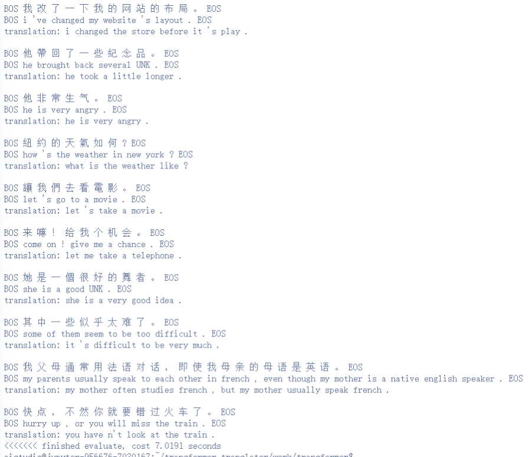

# 第四次实践课作业-Transformer中英翻译
**罗浩铭 PB21030838**

## 题目
修改课程中的代码，使其完成中英翻译（原代码是英中翻译） 同时，将encoder layer的个数设为4，将decoder layer的个数设为5 展示训练后的中英翻译结果

## 实验内容

### 实现中英翻译
进行如下修改使得原来的模型变为中英翻译模型：

在`splitBatch`函数中，将`batches.append(Batch(batch_en, batch_cn))`修改为`batches.append(Batch(batch_cn, batch_en))`，这将使得训练集和测试集中的source与target对换，使得训练与测试过程都适配中英翻译。

对换`src_vocab`与`tgt_vocab`如下，这将使模型维度变为适配中英翻译的维度：
```python
src_vocab = len(data.cn_word_dict)
tgt_vocab = len(data.en_word_dict)
```

修改`evaluate`函数，使evaluate过程适配中英翻译。具体修改如下：
- 将模型输入数据改为中文：`src = torch.from_numpy(np.array(data.dev_cn[i])).long().to(DEVICE)`
- 输出符号改为英文：`sym = data.en_index_dict[out[0, j].item()]`
- `greedy_decode`函数的`start_symbol`参数改为`data.en_word_dict["BOS"]`（这条其实不影响正确性，主要影响严谨性）
- 调整输出显示的格式，将输出调回输入、预期输出、真实输出的顺序（这条其实不影响正确性，主要影响严谨性与美观性）

再进行少量注释修改。

完成后的中英翻译测试结果如下：


### 修改encoder与decoder的个数
我们维持API规范来进行修改

先修改配置信息：
```python
N_ENCODER = 4
N_DECODER = 5
```

同时修改`make_model`函数：
先修改函数的参数`N`为`n_encoder, n_decoder`：
```python
def make_model(src_vocab, tgt_vocab, n_encoder = N_ENCODER,
    n_decoder = N_DECODER, d_model=512, d_ff=2048, h=8, dropout=0.1):
```

再将上述参数用于`Encoder`与`Decoder`的调用：
```python
Encoder(EncoderLayer(d_model, c(attn), c(ff),
       dropout).to(DEVICE), n_encoder).to(DEVICE)
Decoder(DecoderLayer(d_model, c(attn), c(attn),
        c(ff), dropout).to(DEVICE), n_decoder).to(DEVICE)
```

再按上述API修改`make_model`的调用：
```python
# Step 2: Init model
model = make_model(
    src_vocab,
    tgt_vocab,
    N_ENCODER,
    N_DECODER,
    D_MODEL,
    D_FF,
    H_NUM,
    DROPOUT
)
```

由此完成修改。

### debug
#### DEVICE类型判断条件错误
源代码中存在如下的判断语句：
```python
if DEVICE == "cuda":
```

但由于`DEVICE = torch.device("cuda")`，因此`DEVICE`的类型是`torch.device`，而不是`str`，因此上述判断语句永远为`False`，与预期值`True`不符。

因此，需要将上述判断语句修改为：
```python
if DEVICE.__str__() == "cuda":
```

## 附：练习
#### 0. 看看原始数据长什么样？
略
#### 1. 把代码跑通（所有的图都是可以展示的，对于理解Transformer非常有用）(含Debug和非Debug)
略
#### 1.5 试试预训练模型 save/models/large_model.pt， 与你自己训的对比一下 
Baseline翻译测试结果如下：

预训练模型翻译测试结果如下：


二者的翻译效果不相上下。

不过，Baseline的best-loss是1.788，预训练模型的best-loss是0.834，预训练模型的loss更低。

#### 2. 看一看建立的英文词典和中文词典长什么样，思考一下为什么要有 "UNK" "BOS" "EOS"
建立的英文词典和中文词典如下：


其为python的`dict`对象，key为词，value为词的编号。其中，`UNK`表示未知词，编号为0；`PAD`表示填充词，编号为1；其余词为数据集分词后出现过的词，按出现频率从高到低编号为2~N。两个词典中，`BOS`表示句子的开始，编号均为2；`EOS`表示句子的结束，编号均为3。

`UNK`、`PAD`、`BOS`、`EOS`的作用如下：
- `UNK`：未知词，当输入不在训练集里时，模型会遇到未知词时，这时需要将其替换为`UNK`，以使得模型可以正常运行。
- `PAD`：填充词，句子长度小于模型接收的最大token长度时，用于填充剩余部分。
- `BOS`：句子开始，`BOS`用于提示模型开始翻译一个句子。
- `EOS`：句子结束，`EOS`用于提示模型结束翻译一个句子。

#### 3. word embedding后的词长什么样？
word embedding由`Embeddings`类实现，代码如下：
```python
class Embeddings(nn.Module):
    def __init__(self, d_model, vocab):
        super(Embeddings, self).__init__()
        self.lut = nn.Embedding(vocab, d_model)
        self.d_model = d_model

    def forward(self, x):
        # return x's embedding vector（times math.sqrt(d_model)）
        return self.lut(x) * math.sqrt(self.d_model)
```

它使用了一个`nn.Embedding`对象，类似于查找表，输入每个词的编号即可得到每个该词的embedding，其为一个`d_model = D_MODEL = 256`维的向量。

因此，word embedding后每个词都是一个`d_model = D_MODEL = 256`维的向量。

#### 4. 思考一下，为什么要加positional_embedding
这是为了让模型能够获得词的位置信息。因为Transformer架构中输入的各个位置是同时进行处理，在微结构上都是对等的，互相之间没有顺序关系，所以需要额外的方式来让模型学习到词的位置信息。


## 附：修改的代码
实验中进行的所有代码修改如下：


